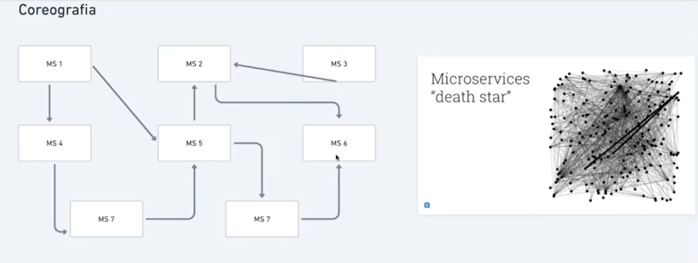
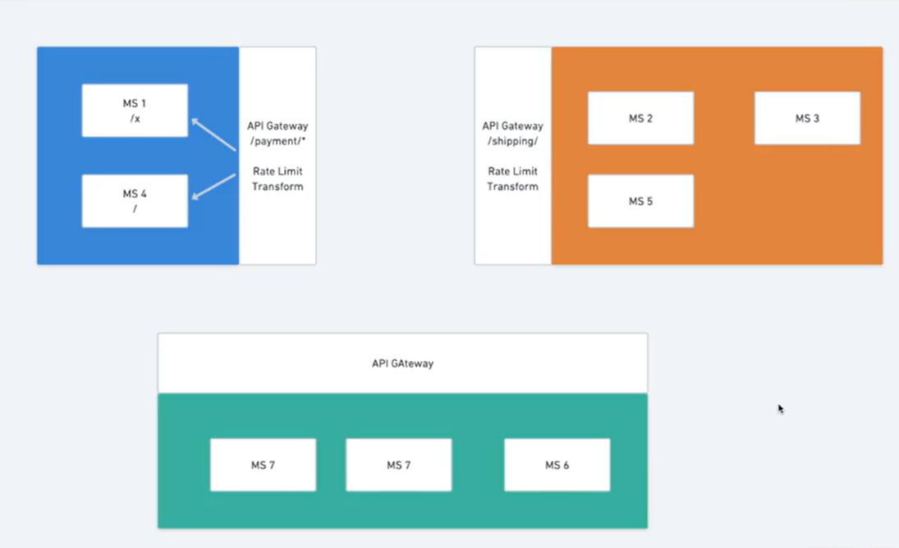
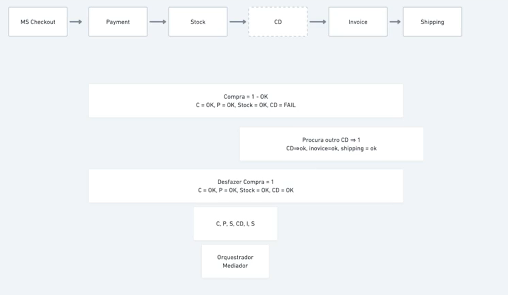
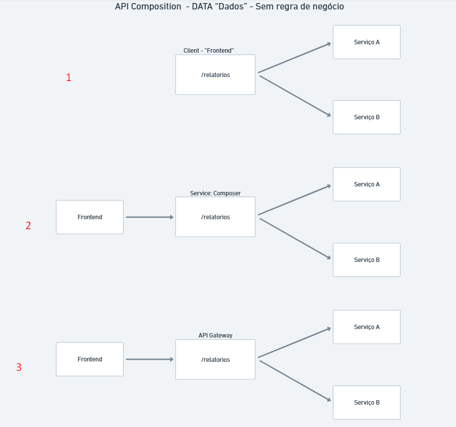
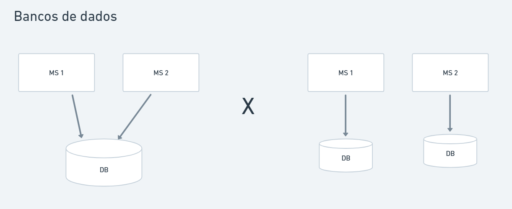
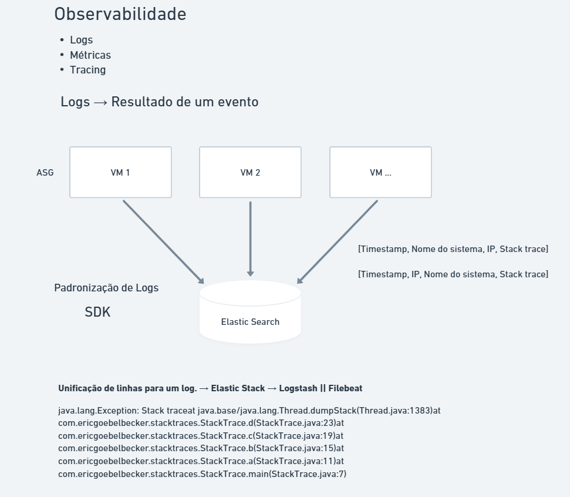
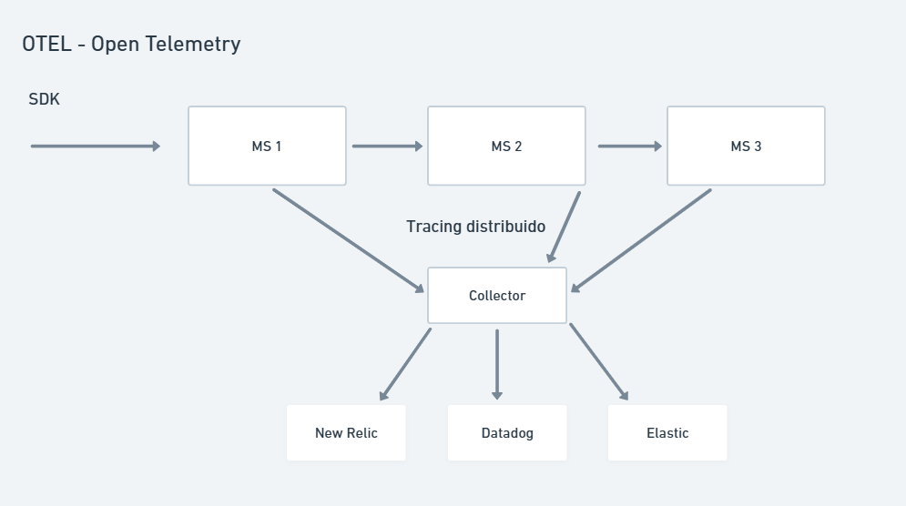
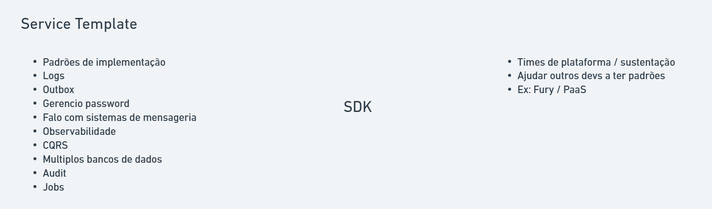

# Arquitetura Baseada em Microsserviços

🧠 Mindmap: https://whimsical.com/arquitetura-baseada-em-microsservicos-LxhyGPUwg3x5ghrc4s6WM4

## Conceitos Básicos

### Pilares Básicos sobre Microsserviços
- Aplicações comuns.
- Objetivos bem definidos.
- Faz parte de um ecossistema.
- São independentes ou autonomos.
- Se comunicam entre si o tempo todo.
- Devem ter bancos de dados independentes.
- Podem ser escritos em linguagens diferentes.

### Principais Diferenças entre Monolito e Microsserviços
- Objetivos / Domínio:
    - Monolito: Objetivo amplo. Toda aplicação. Todos os contextos dentro do mesmo sistema.
    - Microsserviços: Objetivo específico. Um contexto. Uma funcionalidade.
- Linguagem de Programação:
    - Monolito: Geralmente uma única linguagem/tecnologia.
    - Microsserviços: Diversas tecnologias; Pode ser escrita em linguagens diferentes.
- Deploy:
    - Monolito: Deploy único. Toda aplicação.
    - Microsserviços: Deploy independente. Cada serviço.
- Organização da Equipe:
    - Monolito: Equipe única. Todos trabalham no mesmo código.
    - Microsserviços: Equipes pequenas e independentes. Cada equipe pode ser responsável por um ou mais serviços.
- Começar um projeto / POC
    - Monolito: Mais rápido para começar. Menos complexidade inicial.
    - Microsserviços: Pode ser mais complexo no início. Requer planejamento de arquitetura.
- Escalabilidade:
    - Monolito: Escala a aplicação inteira. Pode ser ineficiente.
    - Microsserviços: Escala serviços individualmente. Mais eficiente.
- Manutenção:
    - Monolito: Pode ser mais difícil de manter com o tempo. Código pode se tornar complexo.
    - Microsserviços: Facilita a manutenção. Serviços menores e mais focados.
- Testes:
    - Monolito: Testes podem ser mais complexos. Todo o sistema precisa ser testado.
    - Microsserviços: Testes focados em serviços individuais. Pode ser mais simples.
- Comunicação:
    - Monolito: Comunicação interna. Chamadas de função/métodos.
    - Microsserviços: Comunicação via APIs/HTTP. Pode introduzir latência.
- Banco de Dados:
    - Monolito: Geralmente um único banco de dados.
    - Microsserviços: Bancos de dados independentes para cada serviço.
- Tolerância a Falhas:
    - Monolito: Uma falha pode afetar todo o sistema.
    - Microsserviços: Falhas isoladas. Outros serviços podem continuar funcionando.

### Quando usar microsserviços
- Projetos grandes e complexos.
- Necessidade de escalabilidade.
- Contextos de negócio bem definidos.
- Quando você possui maturidade nos processos de entrega.
- Quando você possui maturidade técnica dos times.
- Quando eu tenho a necessidade de escala de apenas uma parte do meu sistema.

### Quando Monolito é melhor
- POC (prova de conceito)
- Projetos pequenos e simples.
- Novos projetos onde não conhecemos todo o domínio.
- Governança simplificada sobre tecnologias.
- Facilidade na contratação de profissionais.
- Facilidade no treinamento dos devs.
- Tudo em um único lugar.
- Compartilhamento claro de libs (shared kernel).

### Migração de Monolito para Microsserviços
- Identificar os limites do domínio / Separação de contextos (Domain-Driven Design).
- Evitar excesso de granularidade.
- Verifique dependências.
    - Quando um serviço depende muito de outro, talvez eles devam estar juntos (monolito distribuído).
- Planeje o processo de migração dos bancos de dados.
- Utilizar eventos para comunicação entre serviços e para desacoplar dependências.
- Não ter medo de duplicação de dados.
- Consistência eventual.
- Maturidade de processos: CI/CD, Testes, Ambientes.
- Comece pelas beiradas do sistema.
    - Padrão de estrangulamento (Strangler Fig Pattern).

## Características

@Martin Fowler: https://martinfowler.com/articles/microservices.html

### Componentização
Componentização via serviços: Um componente é um pedaço de software que encapsula um conjunto de funcionalidades e expõe uma interface bem definida para interagir com outras partes do sistema. A componentização é o processo de dividir um sistema em componentes menores e independentes, cada um responsável por uma funcionalidade específica que pode ser substituída ou atualizada sem afetar o restante do sistema. A Biblioteca de certa forma é um componente, mas que é considerada "in memory", ou seja, roda dentro do mesmo processo da aplicação. Agora quando estamos falando de serviços, estamos falando de componentes que rodam em processos separados, ou seja, são executados de forma independente (out of process).

### Organização através das áreas de negócio
Cada serviço é responsável por uma capacidade ou funcionalidade específica do negócio, permitindo que equipes multidisciplinares trabalhem de forma independente e ágil.

### Produtos e não projetos
Cada serviço é tratado como um produto independente, com ciclo de vida próprio, desde o desenvolvimento até a manutenção e evolução. Isso permite uma maior autonomia das equipes e uma melhor adaptação às necessidades do mercado.

### Smart endpoints and dumb pipes
Os microsserviços devem ser projetados para serem "smart endpoints", ou seja, eles devem conter a lógica de negócio e serem responsáveis por processar as requisições de forma eficiente. Já os "dumb pipes" referem-se aos mecanismos de comunicação entre os serviços, que devem ser simples e leves, como filas de mensagens ou APIs RESTful. Isso ajuda a manter a simplicidade e a escalabilidade do sistema como um todo. Diferente de um ESB (Enterprise Service Bus) que é um "smart pipe" que contém lógica de negócio e regras de roteamento, o que pode levar a um acoplamento indesejado entre os serviços.

### Governança descentralizada
Cada equipe é responsável por suas próprias decisões técnicas e de arquitetura, permitindo uma maior autonomia e agilidade na entrega de valor ao negócio. Isso inclui a escolha de tecnologias, ferramentas e práticas de desenvolvimento que melhor atendam às necessidades do serviço. No entanto, é importante manter um certo nível de padronização e alinhamento entre as equipes para garantir a interoperabilidade e a coesão do sistema como um todo. Isso pode ser alcançado através de diretrizes e boas práticas compartilhadas, sem impor uma governança centralizada rígida. Sendo assim, deve-se pensar em "consumer driven contract", ou seja, o serviço que consome a API deve definir o contrato (contrato de consumo) e o serviço que provê a API deve seguir esse contrato.

### Dados descentralizados
Cada serviço deve ter seu próprio banco de dados ou esquema de dados, evitando o compartilhamento direto de dados entre os serviços. Isso ajuda a manter a independência e a autonomia dos serviços, permitindo que cada um evolua e escale de forma independente. Além disso, a descentralização dos dados pode melhorar a resiliência do sistema, já que uma falha em um serviço não afeta diretamente os dados de outros serviços. No entanto, é importante considerar estratégias para garantir a consistência e a integridade dos dados em todo o sistema, como o uso de eventos para sincronizar informações entre os serviços quando necessário. Isso pode levar a uma abordagem de consistência eventual, onde os dados podem estar temporariamente inconsistentes, mas eventualmente se tornam consistentes através de mecanismos de sincronização assíncrona. Referente a duplicação de dados, é importante entender que em uma arquitetura de microsserviços, a duplicação de dados pode ser uma prática aceitável e até mesmo necessária para garantir a independência e a autonomia dos serviços. Cada serviço deve ser responsável por seu próprio conjunto de dados, o que pode levar à duplicação de informações entre serviços diferentes. No entanto, é importante gerenciar essa duplicação de forma cuidadosa, utilizando estratégias como eventos para sincronizar dados entre serviços quando necessário, e garantindo que cada serviço mantenha a integridade e a consistência dos seus próprios dados. A duplicação de dados deve ser vista como uma trade-off entre a independência dos serviços e a complexidade adicional na gestão dos dados. Além disso, a duplicação de dados pode melhorar a performance e a escalabilidade do sistema, já que cada serviço pode acessar seus próprios dados localmente, sem depender de chamadas remotas para outros serviços. Portanto, é importante avaliar cuidadosamente as necessidades do sistema e as características dos serviços ao decidir sobre a duplicação de dados em uma arquitetura de microsserviços. Em resumo, a duplicação de dados em uma arquitetura de microsserviços é uma prática aceitável e pode ser benéfica para garantir a independência e a autonomia dos serviços, desde que seja gerenciada de forma cuidadosa e estratégica e sem duplicar informações desnecessariamente.

### Automação de infraestrutura
A automação de infraestrutura é um aspecto crucial em uma arquitetura de microsserviços, pois permite a criação, configuração e gerenciamento de ambientes de forma rápida, eficiente e consistente. Isso inclui a automação de tarefas como provisionamento de servidores, configuração de redes, implantação de aplicações e monitoramento de serviços. Ferramentas como Ansible, Terraform, Kubernetes e Docker são comumente utilizadas para automatizar a infraestrutura em ambientes de microsserviços. A automação ajuda a reduzir erros humanos, aumentar a agilidade na entrega de software e melhorar a escalabilidade e a resiliência do sistema como um todo. Além disso, a automação de infraestrutura facilita a implementação de práticas de DevOps, permitindo que as equipes de desenvolvimento e operações trabalhem de forma mais integrada e colaborativa. Em resumo, a automação de infraestrutura é essencial para o sucesso de uma arquitetura de microsserviços, garantindo que os serviços possam ser implantados, gerenciados e escalados de forma eficiente e confiável.

### Desenhado para falhar
Em uma arquitetura de microsserviços, é fundamental projetar os serviços para serem resilientes e tolerantes a falhas. Isso significa que cada serviço deve ser capaz de lidar com falhas de forma graciosa, sem afetar o funcionamento do sistema como um todo. Algumas estratégias comuns para alcançar essa resiliência incluem:
- **Circuit Breaker**: Implementar padrões de circuit breaker para evitar que falhas em um serviço se propaguem para outros serviços. Quando um serviço detecta que outro serviço está falhando, ele pode interromper temporariamente as chamadas para esse serviço, permitindo que ele se recupere.
- **Retries**: Implementar mecanismos de retry para tentar novamente chamadas que falharam, com backoff exponencial para evitar sobrecarregar o serviço que está falhando.
- **Timeouts**: Definir timeouts para chamadas entre serviços, garantindo que um serviço não fique esperando indefinidamente por uma resposta de outro serviço.
- **Fallbacks**: Implementar estratégias de fallback, onde um serviço pode fornecer uma resposta alternativa ou degradada quando outro serviço está indisponível.
- **Monitoramento e Alertas**: Monitorar continuamente o estado dos serviços e configurar alertas para detectar falhas rapidamente e tomar ações corretivas.
- **Isolamento de Falhas**: Projetar os serviços de forma que uma falha em um serviço não afete diretamente outros serviços, utilizando técnicas como filas de mensagens para desacoplar a comunicação entre serviços.
- **Testes de Resiliência**: Realizar testes de resiliência, como o Chaos Engineering, para identificar pontos fracos na arquitetura e melhorar a capacidade de recuperação dos serviços.
Ao adotar essas estratégias, é possível criar uma arquitetura de microsserviços que seja robusta e capaz de lidar com falhas de forma eficaz, garantindo a continuidade do serviço e uma melhor experiência para os usuários finais.

### Design Evolutivo
A arquitetura de microsserviços deve ser projetada para evoluir ao longo do tempo, permitindo que novos serviços sejam adicionados, serviços existentes sejam modificados ou removidos, e tecnologias sejam atualizadas sem causar interrupções significativas no sistema. Isso envolve a adoção de práticas como:
- **Versionamento de APIs**: Implementar versionamento nas APIs dos serviços para permitir mudanças sem quebrar a compatibilidade com clientes existentes.
- **Desenvolvimento Incremental**: Adotar uma abordagem de desenvolvimento incremental, onde novas funcionalidades são adicionadas gradualmente, permitindo feedback contínuo e ajustes conforme necessário.
- **Refatoração Contínua**: Estar aberto a refatorações e melhorias constantes na arquitetura e no código dos serviços, garantindo que eles permaneçam eficientes e alinhados com as necessidades do negócio.
- **Desacoplamento**: Manter os serviços o mais desacoplados possível, facilitando a substituição ou atualização de serviços individuais sem afetar outros serviços.
- **Automação de Testes**: Implementar testes automatizados para garantir que as mudanças nos serviços não introduzam regressões ou quebras de funcionalidade.
- **Monitoramento Contínuo**: Monitorar o desempenho e a saúde dos serviços para identificar áreas que precisam de melhorias ou ajustes.
- **Cultura de Aprendizado**: Fomentar uma cultura de aprendizado e adaptação, onde as equipes estão sempre buscando maneiras de melhorar a arquitetura e os processos de desenvolvimento.
Ao adotar um design evolutivo, a arquitetura de microsserviços pode se adaptar às mudanças nas necessidades do negócio e nas tecnologias, garantindo sua relevância e eficácia ao longo do tempo.

## Resilência

**Princípio da Resiliência** 
> "Em algum momento todo sistema vai falhar. Falhas são inevitáveis, mas o sistema deve continuar funcionando de forma aceitável mesmo quando partes dele falham."

### O que é resiliência?
- Resiliência é um conjunto de estratégias adotadas **intencionalmente** para a **adaptação** de um sistema quando uma falha ocorre. 
- A principal questão é: Você se dobra ou quebra?
- Ter estratégias de resiliência nos possibilita minimizar os riscos de perda de dados e transaçlões importantes para o negócio.

**Proteger e ser Protegido**
- Um sistema em uma arquitetura distribuída precisa adotar mecanismos de autopreservação para garantir ao máximo sua operação com **qualidade**.
- Um sistema precisa não pode ser "egoísta" ao ponto de realizar mais requisições em um sistema que está falhando.
- Um sistema lento no ar muitas vezes é pior do que um sistema fora do ar (efeito dominó).

### Estratégias de Resiliência

**Health Check**
- Sem sinais vitais, não é possível saber a "saúde" de um sistema.
- Um sistema que não está saudável possui uma chance de se recuperar caso o tráfego pare de ser direcionado a ele temporariamente.
- Health check de qualidade.
    - Deve ser simples e rápido.
    - Deve ser específico para o serviço.
    - Deve ser acessível publicamente (sem autenticação).
    - Deve retornar um status HTTP adequado (200 OK, 503 Service Unavailable).
    - Deve incluir verificações de dependências críticas (banco de dados, serviços externos).
    - Deve ser monitorado continuamente.
    - Deve ser utilizado por orquestradores (Kubernetes, AWS ECS, etc.)
- Health check passivo: As informações de integridade dependem de um estimulo externo (chamadas aos pontos de extemidade) para serem persitidas e/ou obtidas. Isso não deve ser um problema se estiver publicando em um ambiente que já possui um orquestrador (Kubernetes, AWS ECS, etc.) que faz chamadas periódicas ao endpoint de health check (se devidamente configurado) para monitorar a integridade de cada pod.
- Health check ativo: A aplicação é configurada para executar sozinha as vaklidações de integridade periodicamente e persistir o resultado em memória ou em um banco de dados rápido (Redis, Memcached, etc.). Isso é útil quando não se tem um orquestrador que faça chamadas periódicas ao endpoint de health check. Em cenários mais complexos, talvez seja mais interessante usar o modo ativo. Neste modo a execução dos HealthChecks são executados em background utilizando parâmetros globais de 'Delay' e 'Period' além do 'Predicate'. Os parâmetros 'Delay' e 'Period' podem ser perosnalizados para cada HealthCheck.  Em alguns cenários é mais interessante usar o modo ativo aliado a um cache de resultados, persistindo os resultados em memória informando os resultados para as requisições que chegam. Claro que a adoção modo ativo aliado a um cache implica em aceitar um grande **trade-off** de latência entre uma solicitação externa e a periodicidade que foi determinada para execução automática. Esta abordagem de modo ativo aliado a um cache,  pode reduzir o custo de execução das validações de integridade, melhorando a responsividade dos pontos de extremidade de validações de integridade e evitar abusos de requisições (com o custo de execução das validações de integridade) comum em ambientes complexos com muitos micros serviço que fazem chamadas para os pontos de extremidade de validações de integridade na sua aplicação.

**Rate Limiting**
- Protege o sistema baseado no que ele foi projetado para suportar.
- Preferência programada por tipo de client.
- Pode ser implementado em diferentes níveis:
    - Nível de aplicação (dentro do código do serviço).
    - Nível de API Gateway (antes de chegar ao serviço).
    - Nível de infraestrutura (firewall, load balancer).
- Estratégias comuns:
    - Token Bucket
    - Leaky Bucket
    - Fixed Window
    - Sliding Log
    - Sliding Window
- Definir políticas claras de rate limiting.
    - Limites por usuário, IP, API key, etc.
    - Diferentes limites para diferentes tipos de usuários (ex: free vs premium).
    - Limites por endpoint (ex: endpoints críticos podem ter limites mais baixos).

**Circuit Breaker**
- Protege o sistema fazendo com que as requisições feitas para ele sejam negadas. Ex: 500.
- Circuito fechado = Requisições chegam normalmente.
- Circuito aberto = Requisições são negadas imediatamente. Requisições não chegam ao sistema. Erro instantâneo ao client.
- Circuito meio aberto = Requisições são enviadas de forma controlada para testar se o sistema já está saudável. Em outras palavras, ele permite uma quantidade limitada de requisições para verificação se o sistema tem condições de voltar ao ar integralmente.

**API Gateway**
- Garante que requisições "inapropriadas" cheguem até o sistema: Ex: Usuário não autenticado.
- Implementa políticas de Rate Limiting, Health Check, Logging, Monitoramento, etc.
- Nos ajuda a organizar nossos microsserviços em contextos.
- Uma curiosidade importante a se destacar é que a API Gateway nos ajuda a evitar o problema da "estrela da morte" (starvation) por exemplo, onde um serviço depende de muitos outros serviços, criando um acoplamento indesejado e dificultando a resiliência do sistema como um todo. Isso é feito através da implementação de padrões como o "Backend for Frontend" (BFF), onde a API Gateway atua como um intermediário entre o cliente e os microsserviços, agregando e simplificando as chamadas para os serviços backend. Dessa forma, o cliente não precisa fazer múltiplas chamadas para diferentes serviços, reduzindo a complexidade e o acoplamento entre os serviços. Além disso, a API Gateway pode implementar políticas de resiliência, como circuit breakers e rate limiting, para proteger os serviços backend de falhas e sobrecarga. Em resumo, a API Gateway é uma peça fundamental na arquitetura de microsserviços, ajudando a organizar os serviços em contextos, melhorar a resiliência do sistema e evitar problemas como a "estrela da morte".

**Service Mesh**
- Controla o tráfego de rede entre os microsserviços por meio de proxies.
- Proxies podem ser sidecars, que são implantados junto com os microsserviços, ou podem ser proxies dedicados que gerenciam o tráfego entre os serviços.
- Permite a implementação de políticas de segurança, como autenticação e autorização, de forma centralizada.
- Facilita a observabilidade, permitindo monitorar e registrar o tráfego entre os microsserviços.
- Exemplos de Service Mesh incluem Istio, Linkerd e Consul.
- Evita implementações de proteção pelo próprio sistema.
- mTLS (Mutual TLS): Comunicação segura entre serviços, garantindo que ambos os lados da comunicação sejam autenticados.
- Circuit breaker, retry, timeout, fault injection, etc.

**Assíncronia**
- Evita perda de dados e transações importantes para o negócio.
- Evita o efeito dominó.
- Não há perda de dados no envio de uma transação de o server estiver fora.
- Servidor pode processar a transação em seu tempo quando estiver online.
- Entender com profundidade o message broker / sistema de stream.
- Exemplos: RabbitMQ, Apache Kafka, AWS SQS, Google Pub/Sub, etc.

**Garantias de entrega: Retry**
- Linear - Sem backoff.

- Exponencial - Com backoff: Faz com que o tempo entre as tentativas aumente exponencialmente para ajudar o servidor a se recuperar.

- Exponencial com jitter - Com backoff e variação aleatória: Adiciona uma variação aleatória ao tempo de espera para evitar que múltiplas tentativas sejam feitas ao mesmo tempo.

**Garantias de entrega: Kafka**

- Ack 0: O produtor não espera por nenhuma confirmação do broker. A mensagem é considerada enviada assim que é escrita na rede. Isso oferece a menor latência, mas não garante que a mensagem foi realmente recebida pelo broker. Geralmente conhecida como "fire and forget". Exemplos: 
    - Logs de eventos onde a perda ocasional de mensagens é aceitável.
    - Dados de telemetria onde a latência é crítica e a perda de algumas mensagens não afeta significativamente a análise.
- Ack 1: O produtor espera por uma confirmação do líder da partição antes de considerar a mensagem como enviada. Isso garante que a mensagem foi recebida pelo broker, mas pode aumentar a latência. Exemplos:
    - Sistemas de monitoramento onde é importante garantir que os dados foram recebidos, mas a latência não é tão crítica.
    - Aplicações de análise de dados onde a integridade dos dados é importante, mas a latência pode ser tolerada.
- Ack all (ou -1): O produtor espera por confirmações de todos os réplicas da partição antes de considerar a mensagem como enviada. Isso oferece a maior garantia de entrega, mas também a maior latência. Exemplos:
    - Sistemas financeiros onde a integridade dos dados é crítica e a perda de mensagens não é aceitável.
    - Aplicações de comércio eletrônico onde a consistência dos dados é essencial para evitar problemas como pedidos duplicados ou perda de informações de pagamento.

### Situações complexas
- O que acontece se o message broker cair? 
- Haverá perda de mensagens?
- Seu sistema ficará fora do ar?
- Como garantir resiliência em situações complexas?
- Estratégias:
    - Ter um cluster de message broker.
    - Ter mais de um message broker (federation).
    - Ter mais de um data center (disaster recovery).
    - Ter mais de uma região (disaster recovery).
    - Ter mais de uma nuvem (disaster recovery).
    - Padrão Transactional Outbox: Funciona como um buffer local para mensagens que precisam ser enviadas para um message broker. As mensagens são armazenadas em uma tabela de banco de dados local (a "outbox") e são enviadas para o message broker em lotes, garantindo que as mensagens sejam enviadas de forma confiável e consistente, mesmo em caso de falhas no sistema.
    

### Garantias de Recebimento
**Exemplo RabbitMQ**
- Auto Ack = false e commit manual: Garante que a mensagem só será removida da fila quando o consumidor confirmar que a processou com sucesso. Se o consumidor falhar antes de confirmar, a mensagem permanecerá na fila e poderá ser reprocessada por outro consumidor. Essa é uma excelente abordagem para garantir a resiliência e a integridade dos dados.
- Auto Ack = true: A mensagem é removida da fila assim que é entregue ao consumidor, independentemente de o consumidor processá-la com sucesso ou não. Isso pode levar à perda de mensagens se o consumidor falhar durante o processamento. Essa abordagem é mais rápida, mas menos confiável. Evite trabalhar com Auto Ack = true em sistemas onde a integridade dos dados é crítica.
- Prefetch Count: Limita o número de mensagens que um consumidor pode receber antes de confirmar o processamento. Isso ajuda a evitar que um consumidor fique sobrecarregado com muitas mensagens ao mesmo tempo, melhorando a resiliência e a eficiência do sistema.

### Idempotência e Políticas de Fallback
- Saber lidar com mensagens duplicadas.
- Garantir que o processamento de uma mensagem possa ser repetido sem efeitos colaterais indesejados.
- Estratégias:
    - Utilizar identificadores únicos para mensagens (por exemplo, UUIDs) para rastrear e deduplicar mensagens.
    - Implementar lógica de compensação para desfazer efeitos colaterais de mensagens processadas anteriormente.
    - Adotar padrões de design como o "Circuit Breaker" para lidar com falhas temporárias em serviços externos.
  - Independência. Ex: Banco de Dados
  - Políticas claras de fallback.
    - Ex: Retornar dados em cache quando o serviço principal está indisponível.
    - Ex: Retornar uma resposta padrão ou vazia quando o serviço está indisponível.
    - Ex: Redirecionar para um serviço alternativo ou de backup.

### Observabilidade
- Monitoramento: Coleta e análise de métricas para entender o desempenho e a saúde do sistema.
- Logging: Registro detalhado de eventos e atividades do sistema para facilitar a depuração e a análise de problemas.
- Tracing: Rastreio de requisições através dos diferentes serviços para entender o fluxo e identificar gargalos ou falhas.
- Ferramentas comuns: Prometheus, Grafana, ELK Stack (Elasticsearch, Logstash, Kibana), Jaeger, Zipkin, etc.
- Alertas: Configuração de alertas para notificar a equipe sobre problemas críticos no sistema.
- Dashboards: Criação de dashboards para visualizar métricas e logs em tempo real.
- Análise de causa raiz: Utilização de dados coletados para investigar e resolver problemas de forma eficaz.
- Cultura de observabilidade: Incentivar a equipe a adotar práticas de observabilidade como parte do desenvolvimento e operação do sistema.
- **APM (Application Performance Monitoring):** Ferramentas como New Relic, Datadog, AppDynamics, etc., que fornecem monitoramento detalhado do desempenho da aplicação, incluindo tempos de resposta, taxas de erro, e outros indicadores chave de performance (KPIs).
- **Tracing distribuído:** Ferramentas como Jaeger, Zipkin, OpenTelemetry, etc., que permitem rastrear requisições através de múltiplos serviços, ajudando a identificar gargalos e falhas em sistemas distribuídos.

- **Métricas personalizadas:** Coleta de métricas específicas do negócio ou da aplicação, como número de usuários ativos, transações processadas, etc., para entender melhor o impacto do sistema no negócio.
- **Spans personalizados:** Permitem adicionar informações contextuais adicionais às requisições rastreadas, facilitando a análise e depuração. É possível identificar qual a função/método específico dentro do serviço que está causando lentidão ou falhas, ajudando a localizar e resolver problemas de forma mais eficiente.
- **Open Telemetry:** Uma iniciativa de código aberto que fornece uma coleção de ferramentas, APIs e SDKs para instrumentação, geração, coleta e exportação de dados de telemetria (métricas, logs e traces) de aplicações. O OpenTelemetry é suportado por uma ampla comunidade e é adotado por muitas empresas e projetos de código aberto. Ele oferece suporte a várias linguagens de programação, incluindo Java, JavaScript, Python, Go, C#, Ruby, PHP, entre outras. O OpenTelemetry é compatível com várias ferramentas de monitoramento e análise, como Prometheus, Jaeger, Zipkin, Grafana, entre outras. Ele também suporta vários protocolos de exportação de dados, como OTLP (OpenTelemetry Protocol), Jaeger Thrift, Zipkin JSON, entre outros. O OpenTelemetry é uma ferramenta poderosa para melhorar a observabilidade e a resiliência de sistemas distribuídos e microsserviços.

### Referências
- Exponential backoff and jitter: https://aws.amazon.com/pt/blogs/architecture/exponential-backoff-and-jitter/
- Retry: Remédio ou Veneno? https://www.youtube.com/watch?v=1MkPpKPyBps
- OTEL - https://opentelemetry.io/

## Coreografia vs Orquestração

### Como funciona a Coreografia?
- Cada serviço é responsável por reagir a eventos e tomar ações apropriadas.
- Não há um controlador central que coordena as interações entre os serviços.
- Os serviços se comunicam diretamente entre si, geralmente através de eventos ou mensagens.
- Cada serviço é autônomo e pode ser desenvolvido, implantado e escalado independentemente.
- A coreografia é mais adequada para sistemas altamente distribuídos e dinâmicos, onde as interações entre os serviços são complexas e variáveis.
- A coreografia pode ser mais difícil de implementar e gerenciar, pois requer uma boa compreensão das interações entre os serviços e uma comunicação eficaz entre as equipes de desenvolvimento.

**Mitigação da estrela da morte - Estratégias de APIs**
- Divisão de APIs por contexto.
    - Mini-API-Gateway: Um API Gateway para cada contexto.
- A comunicação passa a ocorrer por contextos e não mais entre todos os serviços. Quando quisermos monitorar a comunicação entre os serviços, olhamos para dentro de cada contexto.
- Não trata-se de um Service Mesh, mas sim de uma organização melhor dos serviços com uso de um API Gateway (Ex: Kong API Gateway) por contexto.

### Como funciona a Orquestração?
- Um serviço central (orquestrador) é responsável por coordenar as interações entre os serviços.
- O orquestrador define o fluxo de trabalho e as regras para a comunicação entre os serviços.
- Os serviços se comunicam com o orquestrador, que direciona as chamadas para os serviços apropriados.
- O orquestrador pode ser implementado como um serviço separado ou como parte de uma aplicação principal.
- A orquestração é mais adequada para sistemas com fluxos de trabalho bem definidos e previsíveis, onde as interações entre os serviços são relativamente simples.
- A orquestração pode ser mais fácil de implementar e gerenciar, pois o orquestrador centralizado pode fornecer uma visão clara das interações entre os serviços e facilitar a coordenação entre as equipes de desenvolvimento.
- Existem Patterns de orquestração como o Saga Pattern entre outros que serão vistos mais a frente.
- O orquestrador conhece a ordem e a lógica das interações entre os serviços. Caso algo falhe, o orquestrador pode tomar ações corretivas através de políticas bem definidas de fallback. Com isso podemos garantir que o sistema como um todo continue funcionando de forma aceitável até atender o objetivo principal, mesmo quando partes dele falham. Segue exemplo abaixo:

## Patterns
### API Composition Pattern
#### O que é?
- Um serviço dedicado (API Composition Service) é responsável por agregar dados de múltiplos serviços.
- O serviço de composição expõe uma API unificada para os clientes, simplificando o acesso aos dados.
- O serviço de composição pode implementar lógica adicional, como filtragem, transformação e paginação dos dados.
- O serviço de composição pode ser implementado como um microsserviço separado ou como parte de um serviço existente.
- O API Composition Pattern é útil quando os clientes precisam acessar dados de múltiplos serviços e quando a agregação de dados é complexa ou envolve lógica adicional.
#### Vantagens
- Simplifica o acesso aos dados para os clientes.
- Reduz o número de chamadas que os clientes precisam fazer para obter os dados necessários.
- Permite a implementação de lógica adicional de agregação e transformação de dados.
- Facilita a evolução e a manutenção dos serviços, pois o serviço de composição pode ser atualizado independentemente dos serviços subjacentes.
#### Desvantagens
- Pode introduzir um ponto único de falha, se o serviço de composição ficar indisponível.
- Pode aumentar a latência das requisições, pois o serviço de composição precisa fazer chamadas para múltiplos serviços.
- Pode aumentar a complexidade do sistema, pois o serviço de composição precisa gerenciar a comunicação com múltiplos serviços.
#### Quando usar?
- Quando os clientes precisam acessar dados de múltiplos serviços.
- Quando a agregação de dados é complexa ou envolve lógica adicional.
- Quando a simplicidade e a facilidade de uso para os clientes são prioridades.
#### Exemplo
- Um serviço de e-commerce que precisa gerar um relatório de produtos, avaliações e estoque, que são fornecidas por serviços separados. O serviço de composição pode agregar esses dados e expor uma API unificada para os clientes gerarem os relatórios.

### Decompose by business capability Pattern
#### O que é?
- Dividir a aplicação em serviços baseados nas capacidades de negócio.
- Cada serviço é responsável por uma capacidade ou funcionalidade específica do negócio.
- Cada serviço é autônomo e pode ser desenvolvido, implantado e escalado independentemente.
- Cada serviço possui seu próprio banco de dados ou esquema de dados, evitando o compartilhamento direto de dados entre os serviços.
- A decomposição por capacidade de negócio é uma abordagem orientada ao domínio, que ajuda a alinhar a arquitetura do sistema com as necessidades do negócio.
#### Vantagens
- Alinha a arquitetura do sistema com as necessidades do negócio.
- Permite uma maior autonomia e agilidade das equipes de desenvolvimento.
- Facilita a evolução e a manutenção dos serviços, pois cada serviço pode ser atualizado independentemente dos outros serviços.
- Melhora a escalabilidade do sistema, pois cada serviço pode ser escalado de forma independente.
#### Desvantagens
- Pode aumentar a complexidade do sistema, pois envolve a gestão de múltiplos serviços.
- Pode introduzir desafios de comunicação e coordenação entre os serviços.
- Pode exigir uma mudança cultural nas equipes de desenvolvimento, que precisam adotar práticas de DevOps e automação.
#### Quando usar?
- Quando a aplicação possui múltiplas capacidades ou funcionalidades de negócio (aplicação monolítica).
- Quando a autonomia e a agilidade das equipes de desenvolvimento são prioridades.
- Quando a escalabilidade do sistema é uma preocupação.
#### Exemplo
- Um sistema de e-commerce que possui capacidades distintas, como administração de clientes, compras, CS e financeiro. Cada capacidade pode ser implementada como um serviço separado, permitindo que as equipes de desenvolvimento trabalhem de forma independente e ágil.

### Strangler Application Pattern
#### O que é?
- Uma abordagem para migrar uma aplicação monolítica para uma arquitetura de microsserviços.
- A aplicação monolítica é gradualmente substituída por novos serviços, que são desenvolvidos e implantados de forma independente.
- Os novos serviços são integrados à aplicação monolítica, permitindo que ambos coexistam durante a transição.
- A aplicação monolítica é "estrangulada" à medida que os novos serviços são adicionados, até que a aplicação monolítica seja completamente substituída pelos microsserviços.
- O Strangler Application Pattern é uma abordagem incremental, que permite uma migração suave e controlada, minimizando o risco e o impacto na operação do sistema.
#### Vantagens
- Permite uma migração suave e controlada, minimizando o risco e o impacto na operação do sistema.
- Permite que a aplicação monolítica continue funcionando durante a transição, garantindo a continuidade do negócio.
- Permite que os novos serviços sejam desenvolvidos e implantados de forma independente, facilitando a evolução e a manutenção do sistema.
- Permite que as equipes de desenvolvimento adotem práticas de DevOps e automação, melhorando a agilidade e a eficiência.
#### Desvantagens
- Pode aumentar a complexidade do sistema, pois envolve a gestão de múltiplos serviços e a integração com a aplicação monolítica.
- Pode exigir uma mudança cultural nas equipes de desenvolvimento, que precisam adotar práticas de DevOps e automação.
- Pode introduzir desafios de comunicação e coordenação entre os serviços e a aplicação monolítica.
#### Quando usar?
- Quando a aplicação monolítica é grande e complexa, tornando difícil a migração direta para microsserviços.
- Quando a aplicação monolítica precisa continuar funcionando durante a transição.
- Quando a autonomia e a agilidade das equipes de desenvolvimento são prioridades.
#### Exemplo
- Uma aplicação monolítica de e-commerce que precisa ser migrada para uma arquitetura de microsserviços. A aplicação monolítica pode ser gradualmente substituída por novos serviços, como administração de clientes, compras, CS e financeiro, que são desenvolvidos e implantados de forma independente. Os novos serviços são integrados à aplicação monolítica, permitindo que ambos coexistam durante a transição.
#### Pontos de atenção
* **Comunicação com o monolito:** Durante a transição, os novos microsserviços podem precisar se comunicar com o monolito para acessar dados ou funcionalidades que ainda não foram migradas. Isso pode ser feito através de APIs, filas de mensagens ou outros mecanismos de comunicação.
* **Maturidade da equipe:** A equipe de desenvolvimento deve estar preparada para adotar novas práticas e ferramentas, como DevOps e automação, para garantir uma transição bem-sucedida.
* **Banco de Dados:** A migração do banco de dados pode ser um desafio, especialmente se o monolito e os microsserviços compartilharem o mesmo banco de dados. É importante planejar cuidadosamente a migração dos dados para garantir a integridade e a consistência dos dados durante a transição. Uma ideia que pode ser vantajosa é utilizar o banco compartilhado no início da transição e, à medida que os microsserviços forem sendo desenvolvidos, migrar os dados para bancos de dados independentes para cada microsserviço. Isso é interessante pois ajuda a identificar quais dados e tabelas são realmente necessárias migrar para cada microsserviço, evitando a migração desnecessária de dados e tabelas que não serão utilizados pelos microsserviços.
* **APM (Application Performance Monitoring):** Durante a transição, é importante monitorar o desempenho e a saúde do sistema para identificar e resolver problemas rapidamente. Ferramentas de APM podem ajudar a rastrear requisições, identificar gargalos e falhas, e fornecer insights sobre o comportamento do sistema.
* **Métricas:** Quais as métricas você espera? O que for diferente do esperado, você terá que criar alarmes.
* **Testes automatizados:** É fundamental ter uma boa cobertura de testes automatizados para garantir que as funcionalidades existentes no monolito continuem funcionando corretamente durante a transição. Testes de integração e end-to-end são especialmente importantes para validar a comunicação entre os microsserviços e o monolito.
* **Documentação:** Manter uma documentação clara e atualizada sobre a arquitetura, os serviços e os processos de migração é essencial para garantir que todos os membros da equipe estejam alinhados e possam colaborar efetivamente durante a transição.
* **Planejamento de rollback:** Ter um plano de rollback em caso de problemas durante a migração é crucial para minimizar o impacto no negócio. Isso pode incluir a capacidade de reverter para a versão anterior do monolito ou desativar temporariamente os novos microsserviços.
* **Comunicação com stakeholders:** Manter uma comunicação aberta e transparente com os stakeholders é importante para garantir que todos estejam cientes do progresso da migração, dos desafios enfrentados e das expectativas em relação ao sistema.
* **Gerenciamento de mudanças:** A migração para microsserviços pode envolver mudanças significativas na arquitetura, nos processos e na cultura da equipe. É importante gerenciar essas mudanças de forma eficaz, envolvendo a equipe e os stakeholders no processo e garantindo que todos estejam alinhados com os objetivos e as expectativas da migração.
* **Segurança:** Durante a transição, é importante garantir que os novos microsserviços estejam seguros e protegidos contra ameaças. Isso pode incluir a implementação de autenticação e autorização, criptografia de dados, e monitoramento de segurança.
* **Desempenho:** Monitorar o desempenho do sistema durante a transição é crucial para garantir que os novos microsserviços estejam atendendo aos requisitos de desempenho e escalabilidade. Isso pode incluir a análise de tempos de resposta, taxas de erro, e outros indicadores chave de performance (KPIs).
* **Cultura de aprendizado:** Fomentar uma cultura de aprendizado e adaptação é importante para garantir que a equipe esteja sempre buscando maneiras de melhorar a arquitetura, os processos e as práticas de desenvolvimento. Isso pode incluir a realização de retrospectivas, a participação em conferências e a troca de conhecimentos entre os membros da equipe.
### ACL (Anti-Corruption Layer) Pattern
#### O que é?
- Uma camada intermediária que atua como um tradutor ou adaptador entre dois sistemas ou contextos diferentes.
- A camada de anti-corrupção protege o sistema principal de mudanças ou complexidades introduzidas por um sistema externo ou legado.
- A camada de anti-corrupção pode ser implementada como um microsserviço separado ou como parte de um serviço existente.
- A camada de anti-corrupção é uma abordagem orientada ao domínio, que ajuda a manter a integridade e a consistência do sistema principal.
#### Vantagens
- Protege o sistema principal de mudanças ou complexidades introduzidas por um sistema externo ou legado.
- Permite a integração com sistemas externos ou legados sem comprometer a integridade do sistema principal.
- Facilita a evolução e a manutenção do sistema, pois a camada de anti-corrupção pode ser atualizada independentemente do sistema principal.
- Melhora a clareza e a compreensão do sistema, pois a camada de anti-corrupção pode encapsular a lógica de tradução e adaptação.
#### Desvantagens
- Pode aumentar a complexidade do sistema, pois envolve a gestão de múltiplas camadas.
- Pode introduzir desafios de comunicação e coordenação entre a camada de anti-corrupção e o sistema principal.
- Pode exigir uma mudança cultural nas equipes de desenvolvimento, que precisam adotar práticas de DevOps e automação.
#### Quando usar?
- Quando o sistema principal precisa se integrar com sistemas externos ou legados.
- Quando o sistema principal precisa ser protegido de mudanças ou complexidades introduzidas por sistemas externos ou legados.
- Quando a integridade e a consistência do sistema principal são prioridades.
#### Exemplo
- Um sistema de e-commerce que precisa se integrar com um sistema de pagamento legado. A camada de anti-corrupção pode atuar como um tradutor entre o sistema de e-commerce e o sistema de pagamento, garantindo que as mudanças no sistema de pagamento não afetem a integridade do sistema de e-commerce.

### API Gateway Pattern
#### O que é?
- Um ponto de entrada único para todas as requisições dos clientes.
- O API Gateway atua como um intermediário entre os clientes e os microsserviços, roteando as requisições para os serviços apropriados.
- O API Gateway pode implementar funcionalidades adicionais, como autenticação, autorização, rate limiting, logging, monitoramento, etc.
- O API Gateway pode ser implementado como um serviço separado ou como parte de uma aplicação principal.
- O API Gateway é uma peça fundamental na arquitetura de microsserviços, ajudando a organizar os serviços em contextos, melhorar a resiliência do sistema e evitar problemas como a "estrela da morte".
#### Vantagens
- Simplifica o acesso aos microsserviços para os clientes, fornecendo um ponto de entrada único.
- Permite a implementação de funcionalidades adicionais, como autenticação, autorização, rate limiting, logging, monitoramento, etc.
- Facilita a organização dos microsserviços em contextos, melhorando a clareza e a compreensão do sistema.
- Melhora a resiliência do sistema, implementando políticas de resiliência, como circuit breakers e rate limiting.
#### Desvantagens
- Pode introduzir um ponto único de falha, se o API Gateway ficar indisponível.
- Pode aumentar a latência das requisições, pois o API Gateway precisa processar as requisições antes de encaminhá-las aos microsserviços.
- Pode aumentar a complexidade do sistema, pois envolve a gestão de múltiplos serviços e a integração com o API Gateway.
#### Quando usar?
- Quando a aplicação possui múltiplos microsserviços que precisam ser acessados pelos clientes.
- Quando a simplicidade e a facilidade de uso para os clientes são prioridades.
- Quando a resiliência e a organização dos microsserviços são preocupações.
#### Exemplo
- Um sistema de e-commerce que possui múltiplos microsserviços, como administração de clientes, compras, CS e financeiro. O API Gateway pode atuar como um ponto de entrada único para os clientes, roteando as requisições para os microsserviços apropriados e implementando funcionalidades adicionais, como autenticação, autorização, rate limiting, logging, monitoramento, etc.

### BFF (Backend for Frontend) Pattern
#### O que é?
- Uma variação do API Gateway Pattern, onde um API Gateway é criado especificamente para cada tipo de cliente (ex: web, mobile, etc.).
- O BFF atua como um intermediário entre o cliente e os microsserviços, agregando e simplificando as chamadas para os serviços backend.
- O BFF pode implementar funcionalidades adicionais, como autenticação, autorização, transformação de dados, etc.
- O BFF pode ser implementado como um serviço separado ou como parte de uma aplicação principal.
- O BFF é uma abordagem orientada ao cliente, que ajuda a melhorar a experiência do usuário e a simplificar o desenvolvimento do frontend.
#### Vantagens
- Melhora a experiência do usuário, fornecendo uma API otimizada para cada tipo de cliente.
- Simplifica o desenvolvimento do frontend, reduzindo a complexidade das chamadas para os microsserviços.
- Permite a implementação de funcionalidades adicionais, como autenticação, autorização, transformação de dados, etc.
- Facilita a evolução e a manutenção do sistema, pois o BFF pode ser atualizado independentemente dos microsserviços.
#### Desvantagens
- Pode aumentar a complexidade do sistema, pois envolve a gestão de múltiplos serviços e a integração com os microsserviços.
- Pode introduzir desafios de comunicação e coordenação entre o BFF e os microsserviços.
- Pode exigir uma mudança cultural nas equipes de desenvolvimento, que precisam adotar práticas de DevOps e automação.
#### Quando usar?
- Quando a aplicação possui múltiplos tipos de clientes que precisam acessar os microsserviços.
- Quando a experiência do usuário e a simplicidade do desenvolvimento do frontend são prioridades.
- Quando a evolução e a manutenção do sistema são preocupações.
#### Exemplo
- Um sistema de e-commerce que possui múltiplos tipos de clientes, como web e mobile. O BFF pode atuar como um ponto de entrada único para cada tipo de cliente, agregando e simplificando as chamadas para os microsserviços, e implementando funcionalidades adicionais, como autenticação, autorização, transformação de dados, etc.

### Banco de Dados compartilhado x independente
#### Banco de Dados compartilhado
- Vários serviços acessam o mesmo banco de dados.
- Facilita consultas complexas que envolvem múltiplas entidades.
- Pode levar a acoplamento entre serviços.
- Pode dificultar a escalabilidade e a manutenção do sistema.
- Pode introduzir problemas de concorrência e integridade dos dados.
- Pode dificultar a adoção de diferentes tecnologias de banco de dados para diferentes serviços.
#### Banco de Dados independente
- Cada serviço possui seu próprio banco de dados.
- Promove a autonomia e o isolamento dos serviços.
- Facilita a escalabilidade e a manutenção do sistema.
- Pode levar a duplicação de dados e inconsistências.
- Pode dificultar consultas complexas que envolvem múltiplas entidades.
- Pode exigir a implementação de mecanismos de sincronização e consistência entre os bancos de dados.
#### Quando usar Banco de Dados compartilhado?
- Quando os serviços possuem um alto grau de acoplamento e dependência.
- Quando as consultas complexas que envolvem múltiplas entidades são frequentes e críticas para o negócio.
- Quando a simplicidade e a facilidade de uso para os desenvolvedores são prioridades.
- Quando estiver migrando um monolito para microsserviços e ainda não for possível separar os bancos de dados.
#### Quando usar Banco de Dados independente?
- Quando os serviços possuem um baixo grau de acoplamento e dependência.
- Quando a autonomia e o isolamento dos serviços são prioridades.
- Quando a escalabilidade e a manutenção do sistema são preocupações.
#### Exemplo Banco de Dados compartilhado
- Um sistema de e-commerce onde os serviços de administração de clientes, compras, CS e financeiro acessam o mesmo banco de dados para gerenciar informações de clientes, pedidos, produtos e pagamentos.
#### Exemplo Banco de Dados independente
- Um sistema de e-commerce onde cada serviço possui seu próprio banco de dados para gerenciar suas informações específicas. Por exemplo, o serviço de administração de clientes pode ter um banco de dados para gerenciar informações de clientes, enquanto o serviço de compras pode ter um banco de dados separado para gerenciar informações de pedidos e produtos.

### Relatórios e consolidação de informações
#### Desafio
- Em uma arquitetura de microsserviços, os dados estão distribuídos entre múltiplos serviços, o que pode dificultar a geração de relatórios e a consolidação de informações.
- Consultas complexas que envolvem múltiplas entidades podem ser difíceis de implementar e podem levar a problemas de desempenho.
- A consistência dos dados pode ser um desafio, especialmente quando os dados são atualizados por múltiplos serviços.
#### Algumas Estratégias
- **Tabela Projetada:** Criar tabelas projetadas que agregam dados de múltiplos serviços para facilitar consultas e relatórios. Essas tabelas podem ser atualizadas periodicamente ou em tempo real, dependendo dos requisitos do sistema.
- **Eventos para manter consistência:** Utilizar eventos para manter a consistência dos dados entre os serviços. Quando um serviço atualiza seus dados, ele pode publicar um evento que outros serviços podem consumir para atualizar seus próprios dados, incluindo tabelas projetadas.

### Transactional Outbox Pattern
#### O que é?
- Um padrão de design que ajuda a garantir a consistência dos dados em sistemas distribuídos, especialmente em arquiteturas de microsserviços.
- O padrão envolve a criação de uma tabela de "outbox" em cada serviço, onde as mensagens que precisam ser enviadas para outros serviços são armazenadas.
- As mensagens na tabela de outbox são enviadas para um message broker (como RabbitMQ, Apache Kafka, etc.) em um processo separado, garantindo que as mensagens sejam enviadas de forma confiável e consistente.
- O padrão Transactional Outbox é útil para garantir que as mensagens sejam enviadas mesmo em caso de falhas no sistema, evitando a perda de mensagens e garantindo a consistência dos dados.
#### Vantagens
- Garante a consistência dos dados em sistemas distribuídos.
- Evita a perda de mensagens em caso de falhas no sistema.
- Permite o envio de mensagens de forma confiável e consistente.
- Facilita a integração entre serviços, permitindo que as mensagens sejam enviadas de forma assíncrona.
- É independente do message broker utilizado, podendo ser adaptado para diferentes tecnologias.
#### Desvantagens
- Pode aumentar a complexidade do sistema, pois envolve a gestão de múltiplas tabelas e processos.
- Pode introduzir desafios de desempenho, especialmente se a tabela de outbox crescer muito.
- Pode exigir uma mudança cultural nas equipes de desenvolvimento, que precisam adotar práticas de DevOps e automação.
#### Quando usar?
- Quando a consistência dos dados é crítica em sistemas distribuídos.
- Quando a perda de mensagens não é aceitável.
- Quando a integração entre serviços é necessária.
#### Exemplo
- Um sistema de e-commerce onde o serviço de administração de clientes precisa enviar mensagens para o serviço de compras quando um novo cliente é criado. O serviço de administração de clientes pode armazenar as mensagens na tabela de outbox e um processo separado pode enviar as mensagens para o message broker, garantindo que as mensagens sejam enviadas de forma confiável e consistente.

### Secret Manager / Vault Pattern
#### O que é?
- Um padrão de design que ajuda a gerenciar e proteger segredos, como senhas, chaves de API, certificados, etc., em sistemas distribuídos.
- O padrão envolve o uso de um serviço de gerenciamento de segredos (como HashiCorp Vault, AWS Secrets Manager, Azure Key Vault, etc.) para armazenar e gerenciar os segredos de forma segura.
- Os segredos são acessados pelos serviços através de APIs ou SDKs fornecidos pelo serviço de gerenciamento de segredos.
- O padrão Secret Manager / Vault é útil para garantir a segurança e a integridade dos segredos, evitando a exposição acidental ou maliciosa dos segredos.
#### Vantagens
- Garante a segurança e a integridade dos segredos.
- Evita a exposição acidental ou maliciosa dos segredos.
- Facilita o gerenciamento e a rotação dos segredos.
- Permite o controle de acesso granular aos segredos, garantindo que apenas os serviços autorizados possam acessar os segredos.
- Centraliza o gerenciamento dos segredos, facilitando a auditoria e o monitoramento.
#### Desvantagens
- Pode aumentar a complexidade do sistema, pois envolve a gestão de um serviço adicional.
- Pode introduzir desafios de desempenho, especialmente se o serviço de gerenciamento de segredos ficar indisponível.
- Pode exigir uma mudança cultural nas equipes de desenvolvimento, que precisam adotar práticas de DevOps e automação.
#### Quando usar?
- Quando a segurança e a integridade dos segredos são críticas.
- Quando a exposição acidental ou maliciosa dos segredos não é aceitável.
- Quando o gerenciamento e a rotação dos segredos são necessários.
#### Exemplo
- Um sistema de e-commerce onde os serviços precisam acessar segredos, como senhas de banco de dados, chaves de API, certificados, etc. Os segredos podem ser armazenados e gerenciados por um serviço de gerenciamento de segredos, garantindo que os segredos sejam protegidoss e acessados de forma segura pelos serviços.

### Observabilidade - Padronização de Logs
#### O que é?
- É o resultado de um evento.
- Um padrão de design que ajuda a padronizar o formato e o conteúdo dos logs gerados pelos serviços em um sistema distribuído.
- O padrão envolve a definição de um formato comum para os logs, incluindo campos como timestamp, nível de log, mensagem, contexto, etc.
- Os logs são gerados pelos serviços utilizando bibliotecas ou frameworks que suportam o formato definido.
- O padrão de padronização de logs é útil para facilitar a análise e a correlação dos logs, melhorando a observabilidade e a depuração do sistema.
#### Vantagens
- Facilita a análise e a correlação dos logs.
- Melhora a observabilidade e a depuração do sistema.
- Permite a integração com ferramentas de monitoramento e análise de logs, como ELK Stack (Elasticsearch, Logstash, Kibana), Splunk, etc.
- Facilita a auditoria e o monitoramento dos logs.
- Melhora a consistência e a qualidade dos logs gerados pelos serviços.
#### Desvantagens
- Pode aumentar a complexidade do sistema, pois envolve a definição e a gestão de um formato comum.
- Pode exigir uma mudança cultural nas equipes de desenvolvimento, que precisam adotar práticas de DevOps e automação.
- Pode introduzir desafios de desempenho, especialmente se os logs forem gerados em grande volume.
#### Quando usar?
- Sempre, especialmente em sistemas distribuídos.
#### Exemplo
- Um sistema de e-commerce onde os serviços precisam gerar logs de forma consistente para facilitar a análise e a depuração.

### Observabilidade - Open Telemetry (OTEL)
#### O que é?
- É um conjunto de ferramentas, APIs e SDKs que permite a observabilidade de sistemas distribuídos.
- O OTEL fornece (por meio de uma abstração) uma maneira padronizada de coletar e exportar dados de telemetria, como métricas, logs e rastreamentos.
- O objetivo do OTEL é facilitar a instrumentação de aplicações e serviços, permitindo uma melhor visibilidade e monitoramento do sistema.
- O OTEL é uma iniciativa de código aberto, suportada por uma ampla comunidade e adotada por muitas empresas e projetos de código aberto.
#### Vantagens
- Facilita a instrumentação de aplicações e serviços.
- Permite a coleta e exportação de dados de telemetria de forma padronizada.
- Melhora a visibilidade e o monitoramento do sistema.
- Integra-se com várias ferramentas de monitoramento e análise, como Prometheus, Jaeger, Zipkin, Grafana, etc.
- Suporta várias linguagens de programação, incluindo Java, JavaScript, Python, Go, C#, Ruby, PHP, entre outras.
#### Desvantagens
- Pode aumentar a complexidade do sistema, pois envolve a gestão de múltiplas ferramentas e processos.
- Pode exigir uma mudança cultural nas equipes de desenvolvimento, que precisam adotar práticas de DevOps e automação.
- Pode introduzir desafios de desempenho, especialmente se os dados de telemetria forem coletados em grande volume.
#### Quando usar?
- Sempre, especialmente em sistemas distribuídos.
#### Exemplo
- Um sistema de e-commerce onde os serviços precisam ser instrumentados para coletar métricas, logs e rastreamentos, permitindo uma melhor visibilidade e monitoramento do sistema.

### Service Template Pattern
#### O que é?
- Um padrão de design que ajuda a padronizar a criação e a configuração de serviços em um sistema distribuído.
- O padrão envolve a definição de um modelo ou template para os serviços, incluindo aspectos como estrutura de diretórios, configuração, dependências, etc.
- Os serviços são criados utilizando o template definido, garantindo consistência e padronização entre os serviços.
- O padrão Service Template é útil para facilitar a criação e a manutenção dos serviços, melhorando a eficiência e a qualidade do desenvolvimento.
#### Vantagens
- Facilita a criação e a manutenção dos serviços.
- Melhora a eficiência e a qualidade do desenvolvimento.
- Garante consistência e padronização entre os serviços.
- Permite a reutilização de código e configuração, reduzindo o esforço de desenvolvimento.
- Facilita a adoção de práticas de DevOps e automação, como CI/CD, testes automatizados, etc.
#### Desvantagens
- Pode aumentar a complexidade do sistema, pois envolve a definição e a gestão de um template.
- Pode exigir uma mudança cultural nas equipes de desenvolvimento, que precisam adotar práticas de DevOps e automação.
- Pode introduzir desafios de flexibilidade, especialmente se os serviços tiverem requisitos muito diferentes.
#### Quando usar?
- Sempre, especialmente em sistemas distribuídos.
#### Exemplo
- Um sistema de e-commerce onde os serviços precisam ser criados de forma consistente e padronizada, facilitando a criação e a manutenção dos serviços.

## C4 Model
### O que é?
- Uma abordagem para visualizar a arquitetura de software em diferentes níveis de abstração.
- O C4 Model foi criado por Simon Brown e é composto por quatro níveis principais de diagramas: Contexto, Contêiner, Componente e Código.
- O objetivo do C4 Model é fornecer uma maneira clara e consistente de comunicar a arquitetura de software para diferentes públicos, desde desenvolvedores até stakeholders de negócios.
### Níveis do C4 Model
- **Diagrama de Contexto:** Mostra o sistema como um todo e suas interações com atores externos, como usuários, sistemas externos e outras partes interessadas.
- **Diagrama de Contêiner:** Mostra os principais contêineres (aplicações, serviços, bancos de dados, etc.) que compõem o sistema e suas interações.
- **Diagrama de Componente:** Mostra os principais componentes dentro de um contêiner e suas interações.
- **Diagrama de Código:** Mostra a estrutura interna de um componente, incluindo classes, interfaces e outros elementos de código.
### Vantagens do C4 Model
- Fornece uma maneira clara e consistente de comunicar a arquitetura de software.
- Permite a visualização da arquitetura em diferentes níveis de abstração, facilitando a compreensão para diferentes públicos.
- Ajuda a identificar e resolver problemas de arquitetura, como acoplamento excessivo, falta de modularidade, etc.
- Facilita a documentação e a manutenção da arquitetura de software.
### Exemplos
https://c4model.com/diagrams
https://github.com/devfullcycle/C4-Microservices
### Ferramentas
- graphviz: https://graphviz.org/download/
- plantuml: https://github.com/plantuml-stdlib/C4-PlantUML
